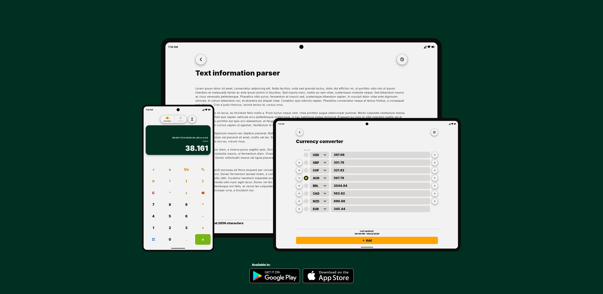

<h1 align="center">Nove: All-in-one calculator, unit converter, BMI calculator, and utility suite</h1>

 
 

  <a href="#description">✍️ Description</a> &nbsp;&nbsp;&nbsp;|&nbsp;&nbsp;&nbsp; <a href="#download_at">⬇️ Download at</a> &nbsp;&nbsp;&nbsp;|&nbsp;&nbsp;&nbsp; <a href="#warnings">⚠️ Warnings</a> &nbsp;&nbsp;&nbsp;|&nbsp;&nbsp;&nbsp; <a href="#technologies">🚀 Technologies</a> &nbsp;&nbsp;&nbsp;|&nbsp;&nbsp;&nbsp; <a href="#contact">✉️ Contact</a>

 
 

<h3 id="description">✍️ Description:</h3>

Nove is a fast, lightweight utility app that brings together essential calculation and conversion tools in a single place.

Whether you need to perform calculations, convert units, calculate BMI, analyze text, or work with time values, Nove provides a clean and intuitive experience designed for everyday use.

Features:

• Calculator with expression evaluation and history
 
• Length converter
 
• Mass and weight converter
 
• Area converter
 
• Speed converter
 
• Temperature converter
 
• Time converter
 
• Currency converter with up-to-date exchange rates
 
• Binary, octal, decimal, and hexadecimal converter
 
• BMI (Body Mass Index) calculator
 
• Time calculator and time aggregator
 
• Text information analyzer

Designed with simplicity and performance in mind, Nove helps you complete common calculations and conversions quickly without unnecessary complexity.

Why choose Nove?

• Multiple utilities in one app
 
• Clean and responsive interface
 
• Accurate conversion formulas
 
• Lightweight and easy to use
 
• No account required
 
• Privacy-friendly design

Whether you're a student, professional, engineer, traveler, or simply need reliable everyday tools, Nove provides the utilities you need in a single convenient application.

 

<h3 id="download_at">⬇️ Download at:</h3>

<a href="https://play.google.com/store/apps/details?id=org.tupi.nove">Google Play Store</a>

 

<h3 id="warnings">⚠️ Warnings:</h3>

<strong>Apple App Store availability:</strong> Nove is currently available on Android only. An iOS version is under development and the App Store release is planned. Availability on Apple devices depends on the completion of the publishing process, and the app will be released as soon as it is ready.

 

<h3 id="technologies">🚀 Technologies:</h3>

This project uses:

- [Flutter](https://github.com/flutter/flutter)
- [Flutter Testing Library](https://github.com/dart-lang/test)
- [Math Expressions](https://github.com/fkleon/math-expressions)
- [MMKV](https://github.com/Tencent/MMKV)
- [Json Serializable](https://github.com/google/json_serializable.dart)

 

<h3 id="contact">✉️ Contact:</h3>

**Creator's GitHub:**
<a href="https://github.com/samueldecarvalhodeveloper">https://github.com/samueldecarvalhodeveloper</a>
 
**Tupi's email:**
<a href="mailto:tupi.softwarehouse@gmail.com">tupi.softwarehouse@gmail.com</a>
